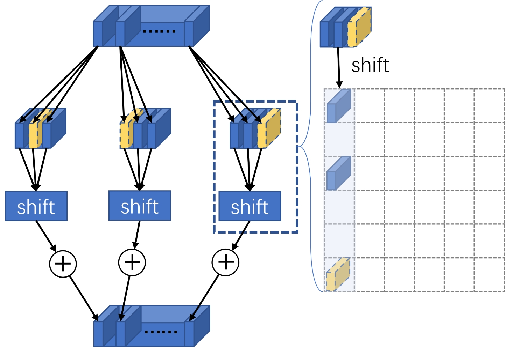

# shift-wise conv
Official PyTorch implementation of 
[Shift-ConvNets: Small Convolutional Kernel with Large Kernel Effects]()
<p align="center">

</p>

We propose the **Shift-Wise** operator, a ConvNet model that uses large convolutional kernels to capture long-range sparse dependencies.

## Installation

The code is tested used CUDA 11.7, cudnn 8.2.0, PyTorch 1.10.0.

Create an new conda virtual environment
```
conda create -n shiftWise python=3.8 -y
conda activate shiftWise
```

Install [Pytorch](https://pytorch.org/)>=1.10.0. For example:
```
conda install pytorch==1.10.0 torchvision==0.11.0 torchaudio==0.10.0 cudatoolkit=11.3 -c pytorch -c conda-forge
pip install timm tensorboardX six
```

## evaluation
```
# to test on imagenet with SLaK_reg_tiny
python main.py --model SLaK_reg_tiny --eval true --Decom True --kernel_size 51 49 47 13 5 --width_factor 1.3 --resume checkpoints/SLaK_tiny_checkpoint.pth --input_size 224 --drop_path 0.2 --data_path /workspace/public_data/imagenet2012/

# train tiny pw-random model
python -m torch.distributed.launch --nproc_per_node=3 main.py  --Decom True --sparse --width_factor 1.3 -u 2000 --sparsity 0.4 --sparse_init snip  --prune_rate 0.5 --growth random --epochs 300 --model SLaK_pw_tiny --drop_path 0.1 --batch_size 64 --lr 4e-3 --update_freq 21 --model_ema true --model_ema_eval true --data_path /workspace/public_data/imagenet2012/ --num_workers 40 --kernel_size 51 49 43 13 5 --output_dir checkpoints/pw_random

# train tiny pw-weight model
python -m torch.distributed.launch --nproc_per_node=3 main.py  --Decom True --sparse --width_factor 1.3 -u 2000 --sparsity 0.4 --sparse_init snip  --prune_rate 0.5 --growth random --epochs 300 --model SLaK_pww_tiny --drop_path 0.1 --batch_size 48 --lr 4e-3 --update_freq 28 --model_ema true --model_ema_eval true --data_path /workspace/public_data/imagenet2012/ --num_workers 40 --kernel_size 51 49 45 13 5 --output_dir checkpoints/pw_weight
```


## ToDo List
- [√] 分离51*5类似的大卷积核为小卷积核   
- [√] 双分支共享卷积 
  - [√] 测试了一分支按顺序，另一分支shuffle后进行组合
  - [√] 一分支正常，另外一分支加权——参数量增加
  - [√] resnet的identity分支来自独立的卷积核
- [√] 小卷积的padding测试
  - [√] k-1
  - [√] k//2
- [√] 以小卷积核为粒度的粗粒度剪枝
- [√] taichi太极实现高效的shift用于推理
- [√] 复制大卷积核模块分支，使用多分支形式训练——用于提精度

## 结果
 **标号** | **实验**                   | **acc@1&120 epochs** | **acc@1&300 epochs** | **代码**                      
:------:|:------------------------:|:--------------------:|:--------------------:|:---------------------------:
 **1**  | SLaK-T baseline          | 81.6                 | 82.5                 |                             
 **2**  | 自测SlaK-T                 |                      | 82.482               |                             
 **3**  | 分离51*5类似的大卷积核为小卷积核       |                      | 82.482               | models/SLaK_reg.py          
 **4**  | 双分支共享卷积：加权               |                      | 82.27                | models/SLaK_pw_wt.py        
 **5**  | 双分支共享卷积：shuffle          |                      | 82.27                | models/SLaK_pw.py           
 **6**  | padding改为不超过Kernel大小：K-1 |                      | 82.38                | models/SLaK_pw_fixpad.py    
 **7**  | 粗粒度剪枝，pad=k-1            | 81.36                |                      | models/SLaK_pw_fixpad.py    
 **8**  | 粗粒度剪枝，pad=k//1           | 81.26                |                      | models/SLaK_pw_fixpad.py    
 **9**  | 多分支                      | **82.05**            |                      | models/SLaK_pw_fixpadRN.py  


## based on repository [Sparse Large Kernel Network - SLaK](https://github.com/VITA-Group/SLaK)

 **name**   | **resolution** | **acc@1**       | **model**                                                                                          
:----------:|:--------------:|:---------------:|:--------------------------------------------------------------------------------------------------:
 **SLaK-T** | 224x224        | 82.5(300epoch)  | [Google Drive](https://drive.google.com/file/d/1Iut2f5FMS_77jGPYoUJDQzDIXOsax1u4/view?usp=sharing) 
 **SLaK-T** | 224x224        | 81.6(120epochs) | [Surf Drive](https://surfdrive.surf.nl/files/index.php/s/WiQYWNclJ9bW5XV)                          

## cite
If you find this repository useful, please consider giving a star star and cite our paper.

